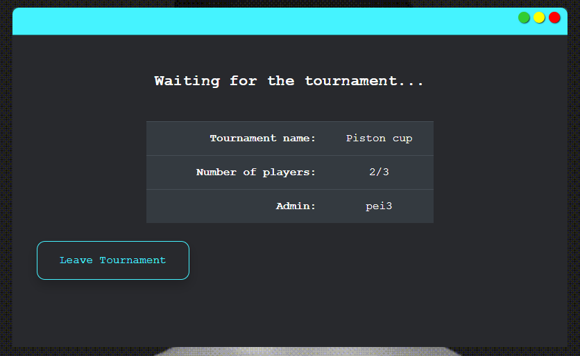

# FT_TRANSCENDENCE

## About the project
### Description 
This project is the last mandatory project in the cursus of the 42 Network. On it, we will need to create a website for play Pong games. Later, you will see that what starts out as pong ends up being online 8 Ball Pool.

### About us
The team was made up for five 42 Network students:

- [kingcreek](https://github.com/kingcreek)
- [robrodri](https://github.com/RobertoRobrodri)
- [jalvarad](https://github.com/jalvarad-1)
- [vgutten](https://github.com/Gutten42)
- [dpavon-g](https://github.com/dpavon-g)

### How to execute

First, you need to have installed docker and docker-compose in your environment.
Once you have it installed, you will need only to execute the next command and pray that you have enough ram in your computer.

`$ docker-compose up --build`

## The game

### Game environment and user experience

 
    
     

 

The main objective we had when creating the design and user experience of our game, was for the user to feel like they were operating an operating system.
This is why, apart from the game, we decided to create an entire OS environment with things like: window management, program management, 
a browser to search for web pages on the Internet, and a real shell with which you can run commands from the operating system itself.

Now you can see some front things our project have:

- Windows and programs management:

    You can move the game windows and the programs icons as you want for all the desktop.

 
    
     

 

- A semi-real terminal where you can execute your commands:

    Here, you can create files and exec some basics commands inside a docker container, 
    It's just a decoration environment, please don't judge it as a complete profesional terminal :D 

 

 
    
     

 

- A browser in which you can search the internet.

    In this case, we are using an Iframe, so there are a lot of pages that it cant be displayed, for example, your bank WebPage (I hope) :D
    But there are lots of pages that doesnt have this limitations. For example, Bing or our game.

 

 
    
     

 

 
    
     

 

### The gameplay

The first objective of the project was to make a local pong game that two people 
could play in, but those in charge of designing and creating the game lost their minds and the rest is history...

From our operating system you can play the following game modes:

- 8 Ball Pool Online game:

    From the website you can play online pool games with a friend who is also
    connected to the website.
    
    The game camera is free so you can move around the table and rotate as much as you need
    so that your game is perfect.

 

 
    
     

 

- Online pong:

    You can play online pong versus your friends.

 

 
    
     

 

- Offline pong and neural network oponent:

    It could happen that your friends were not connected to the platform or that you did not have internet to play. 
    For this reason, we decided to create several game modes for you to have fun with.

    Here, you can find games like pong versus a neural network, 3D pong, or 4-player pong game.

 

 
    
     

 

### Tournaments

If playing with a friend seems boring to you or, if you are lucky enough to have more than one, you probably want the opportunity to play a pong tournament with them.

This is why we decided to create the mode to hold tournaments, here you can create tournaments from 3 to infinite players (Or as many as your server can support) and it will not end until there is one left.

 

 
    
     

 

 
    
     

 

Finally, when a tournament ends insert all the tournament registry on the blockchain and you can watch your tournament results whenever you want from your profile.

 

 
    
     

 

 
    
     

 

### The chat

Any user can talk to any other user through chat, they can also block, view their profile, and invite them to play a game of online pong.

 

 
    
     

 

### More things

There are many more things that our project is capable of handling, like edit profile, add friends, see leaderboard, etc.
Unfortunately, actually I doesnt have enought time to document all. If you want to know more, I encourage you to try the game yourself and if you have any questions,
contact me or anyone of my mates :D